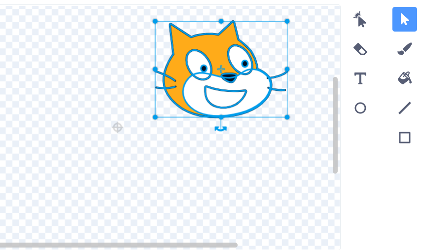
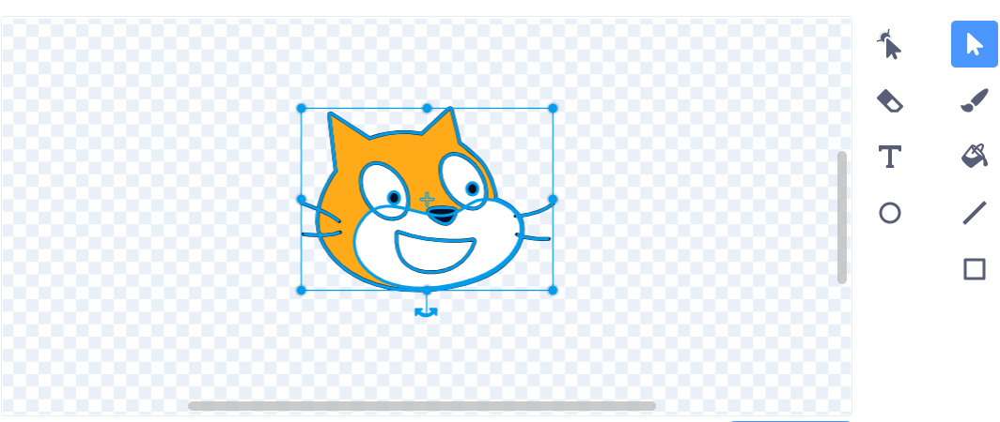
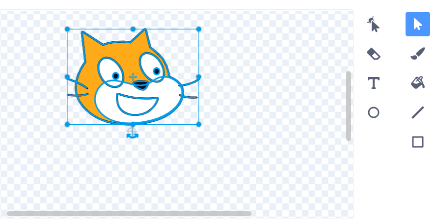

تدور الكائنات حول مركزها. يمكنك معرفة ما إذا كان الكائن الخاص بك في المنتصف من خلال النظر إلى علامة التقاطع الرمادية الصغيرة الموضحة في محرر الرسم.

{:width="200px"}

إذا لم يكن هذا في وسط المظهر الخاص بالكائن، يمكنك استخدام **تحديد** لإختيار المظهر بالكامل. سيظهر بعد ذلك اشارة تقاطع في وسط المظهر الذي تم اختياره.

{:width="500px"}

يمكنك سحب المظهر الذي تم اختياره بحيث يتراصف التقاطع الموجود على المظهر مع موضع الصليب.

{:width="500px"}

في بعض الأحيان، قد ترغب في اختيار نقطة للدوران حولها لا تكون مركز المظهر. في هذه الحالة، يمكنك محاذاة نقطة دوران المظهر التي اخترتها مع التقاطع في محرر الرسم.

{:width="500px"}
