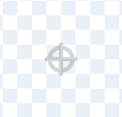

Sprity rotují kolem svého středu. Chcete-li zjistit, zda je váš sprite vycentrován, podívejte se na malý šedý zaměřovač zobrazený v editoru Malování:

{:width="200px"}

Pokud zaměřovač není ve středu vašeho kostýmu, můžete použít nástroj **Vybrat** a zvýraznit celý kostým. Uprostřed vašeho zvýrazněného kostýmu se pak zobrazí křížek:

{:width="500px"}

Zvýrazněný kostým můžete přetáhnout tak, aby byl kříž v kostýmu zarovnán s zaměřovačem:

{:width="500px"}

Občas můžete chtít vybrat bod, kolem kterého se budete otáčet, který není středem kostýmu. V takovém případě můžete vybraný bod otáčení kostýmu zarovnat se zaměřovačem v editoru Malování:

{:width="500px"}
