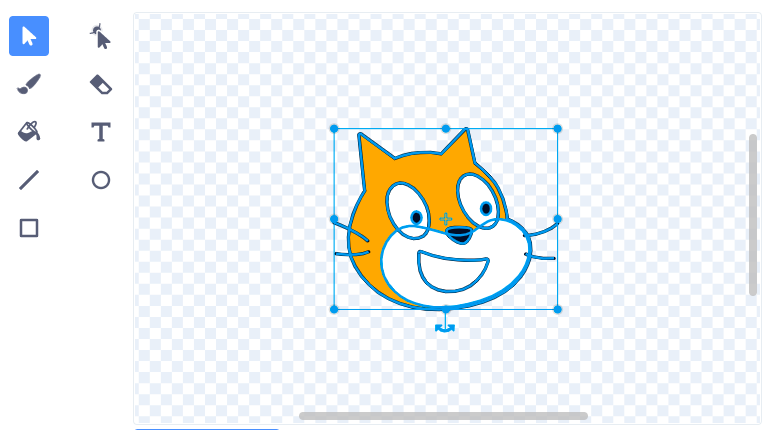
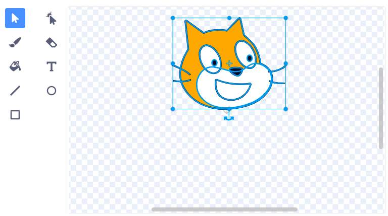

Figuren drehen sich um ihren Mittelpunkt. Im Mal-Editor erkennst du, ob deine Figur zentriert ist, indem du das kleine graue Fadenkreuz ansiehst:

{:width="200px"}

Wenn es sich nicht in der Mitte des Kostüms befindet, hebe das gesamte Kostüm mithilfe des **Auswählen**-Tools hervor. Daraufhin erscheint ein Kreuz in der Mitte des hervorgehobenen Kostüms:

{:width="500px"}

Ziehe das Kostüm, bis das Kreuz genau auf dem Fadenkreuz liegt:

{:width="500px"}

Manchmal möchtest du vielleicht einen Drehpunkt wählen, der nicht genau in der Mitte des Kostüms liegt. Richte in diesem Fall den gewünschten Drehpunkt des Kostüms am Fadenkreuz im Mal-Editor aus:

{:width="500px"}
