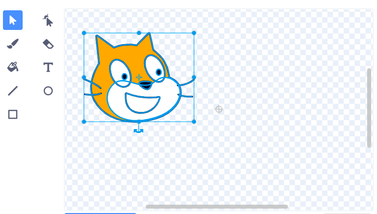

In Scratch you can paint, edit or upload costumes for your sprites. During this process the centre of the sprite's costume could shift meaning that any code you add to your sprite might not run as you expected it to. 

You can see if your sprite is off centre by looking at the small grey crosshair shown in the Paint editor. 

{:width="200px"}

If this is not at the centre of your costume you can use the **Select** tool to highlight the full costume. A cross will then show in the centre of your highlighted costume. 

{:width="500px"}

You can drag the highlighted costume so that the cross on the costume aligns with the crosshair position.

{:width="500px"}

Sometimes you might want to choose a point to rotate round that is not the centre of the costume. In this case you would align your chosen rotation point with the crosshair on the Paint editor.

{:width="500px"}
