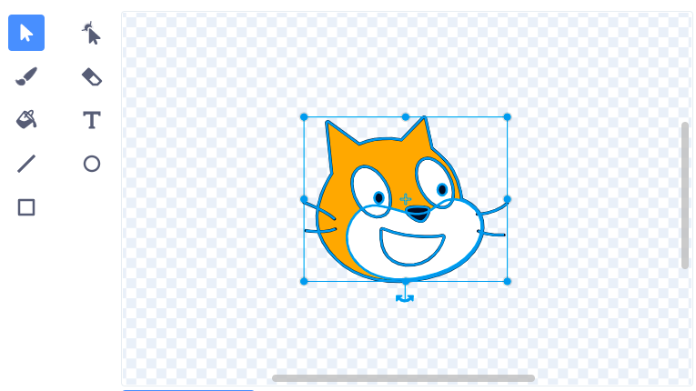

Les sprites tournent autour de leur centre. You can see if your sprite is centred by looking at the small grey crosshair shown in the Paint editor:

{:width="200px"}

If the crosshair is not at the centre of your costume, you can use the **Select** tool to highlight the full costume. A cross will then show in the centre of your highlighted costume:

{:width="500px"}

You can drag the highlighted costume so that the cross in the costume aligns with the crosshair:

{:width="500px"}

Parfois, tu voudras peut-être choisir un point de rotation qui n'est pas le centre du costume. In that case, you can align your chosen costume rotation point with the crosshair in the Paint editor:

{:width="500px"}
