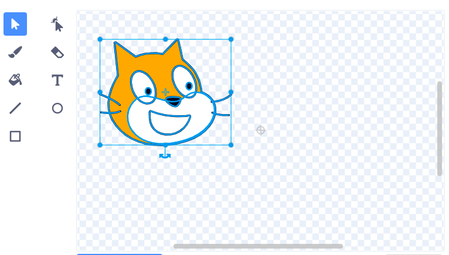

स्प्राइट्स केंद्र के चारों ओर घूमते हैं। आप पेंट संपादक में दिखाए गए छोटे ग्रे क्रॉसहेयर को देखकर पता कर सकते हैं कि आपका स्प्राइट केंद्रित है या नहीं:

{:width="200px"}

यदि क्रॉसहेयर आपकी पोशाक के केंद्र में नहीं है, तो आप पूरी पोशाक को हाइलाइट करने के लिए **चुनना** टूल का उपयोग कर सकते हैं। फिर आपकी हाइलाइट की गई पोशाक के केंद्र में एक क्रॉस दिखाई देगा:

{:width="500px"}

आप हाइलाइट की गई पोशाक को खींच सकते हैं ताकि पोशाक में क्रॉस क्रॉसहेयर के साथ संरेखित हो:

{:width="500px"}

कभी-कभी, आप घूमने के लिए एक बिंदु चुनना चाह सकते हैं जो पोशाक का केंद्र नहीं है। उस स्थिति में, आप अपने चुने हुए पोशाक रोटेशन बिंदु को पेंट संपादक में क्रॉसहेयर के साथ संरेखित कर सकते हैं:

{:width="500px"}
