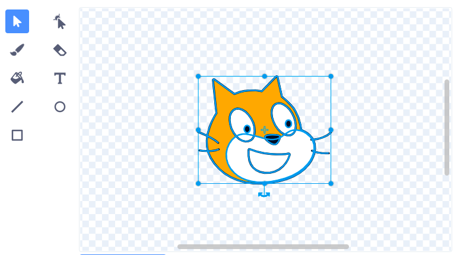

Likovi se okreću oko svog središta. Možeš vidjeti je li tvoj lik centriran ako pogledaš sivi križić u Paint uređivaču:

{:width="200px"}

Ako križić nije u središtu tvog kostima, možeš upotrijebiti alat **Označi** da označiš cijeli kostim. Križić će se tada prikazati u sredini tvog označenog kostima:

{:width="500px"}

Možeš povući označeni kostim tako da se križić koji se nalazi u kostimu poravna s križićem uređivača:

{:width="500px"}

Ponekad ćeš htjeti odabrati točku oko koje će se lik rotirati, a koja nije središte kostima. U tom slučaju možeš poravnati odabranu točku rotacije kostima s križićem u Paint uređivaču:

{:width="500px"}
