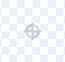
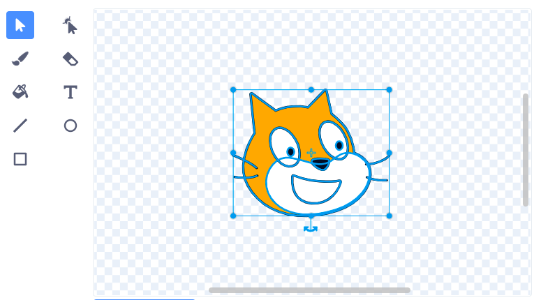

स्प्राइट्स त्यांच्या केंद्राभोवती फिरतात. पेंट एडिटरमध्ये दाखवलेले लहान राखाडी क्रॉसहेअर पाहून तुमचा स्प्राइट मध्यभागी आहे का ते पाहू शकता:

{:width="200px"}

जर क्रॉसहेअर तुमच्या पोशाखाच्या मध्यभागी नसेल, तर तुम्ही पूर्ण पोशाख हायलाइट करण्यासाठी **निवडा** टूल वापरू शकता. त्यानंतर तुमच्या हायलाइट केलेल्या पोशाखाच्या मध्यभागी एक क्रॉस दिसेल:

{:width="500px"}

तुम्ही हायलाइट केलेला पोशाख ड्रॅग करू शकता जेणेकरून पोशाखातील क्रॉस क्रॉसहेअरशी संरेखित होईल:

{:width="500px"}

कधीकधी, तुम्हाला भोवती फिरण्यासाठी एखादा बिंदू निवडायचा असेल जो पोशाखाचा केंद्रबिंदू नाही. अशा परिस्थितीत, तुम्ही पेंट एडिटरमधील क्रॉसहेअरसह तुमचा निवडलेला पोशाख रोटेशन पॉइंट संरेखित करू शकता:

{:width="500px"}
