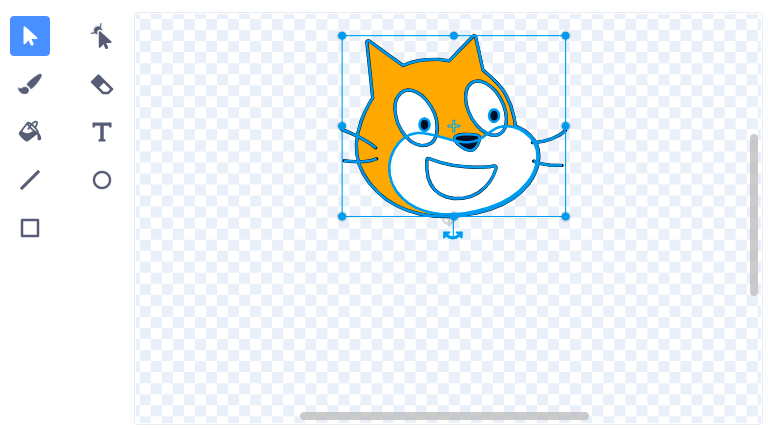

Sprites draaien rond hun middelpunt. Je kunt zien of je sprite gecentreerd is door naar het kleine grijze dradenkruis te kijken dat wordt weergegeven in de Teken editor:

{:width="200px"}

Als dit niet in het midden van je uiterlijk staat, kun je het **Selecteren** gereedschap gebruiken om het volledige uiterlijk te markeren. Er verschijnt dan een kruis in het midden van je gemarkeerde uiterlijk:

{:width="500px"}

Je kunt het gemarkeerde uiterlijk slepen zodat het kruis op het uiterlijk op één lijn ligt met de positie van het dradenkruis:

{:width="500px"}

Af en toe wil je misschien een plek kiezen om te draaien om een punt dat niet het midden van het uiterlijk is. In dat geval kun je het door jou gekozen draaipunt voor het uiterlijk uitlijnen met het dradenkruis in de Teken editor:

{:width="500px"}
