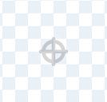
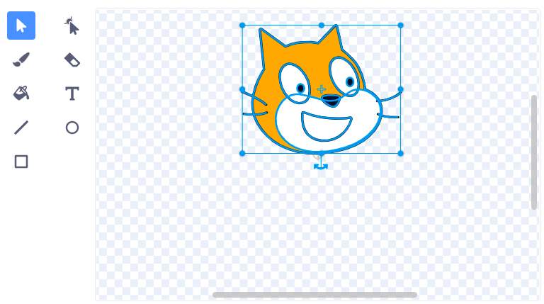

Спрайти обертаються навколо їх центру. Ти можеш перевірити, чи твій спрайт відцентрований, подивившись на маленький сірий приціл, який знаходиться в редакторі Малювання посередині:

{:width="200px"}

Якщо приціл не знаходиться в центрі твого образу, ти можеш використати інструмент **Обрати**, щоб виділити весь образ. Тоді в центрі твого виділеного образу з'явиться хрестик:

{:width="500px"}

Ти можеш перетягнути виділений образ так, щоб хрестик на образі збігся з прицілом:

{:width="500px"}

Інколи тобі може знадобитися вибрати точку для обертання, яка не є центром образа. В такому випадку ти можеш зрівняти обрану тобою точку обертання образа з прицілом в редакторі Малювання:

{:width="500px"}
