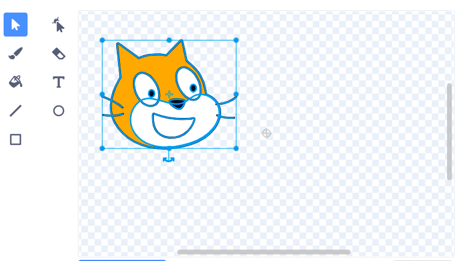
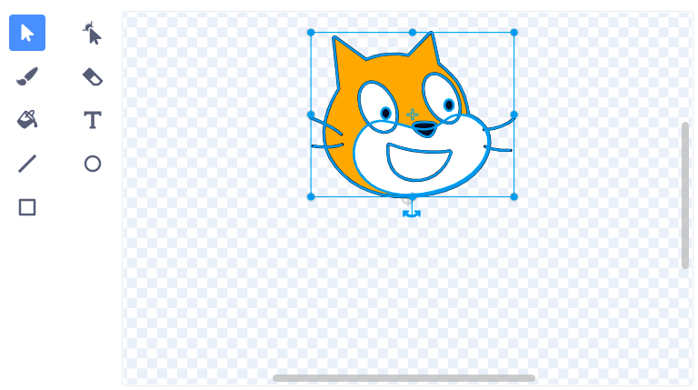

IziSprite zijikeleza kumbindi wazo. Unokubona ukuba isprite sakho sisembindini ngokujonga kujoliso oluncinci olungwevu olubonakalayo kumhleli wePeyinti:

{:width="200px"}

Ukuba Ujoliso aluikho embindini wesinxibo sakho, ungasebenzisa isixhobo **Khetha** sokuqaqambisa isinxibo esipheleleyo. Uphambano lluyakuthi gqi emva koko lubonakale embindini wesinxibo sakho esiqaqambisiweyo:

{:width="500px"}

Ungatsala isinxibo esigqaqanjisiweyo ukuze isiphambano kwisinxibo simelane nojoliso:

{:width="500px"}

Kwelinye ixesha, unokufuna ukukhetha indawo yokujikeleza elingengombindi wempahla. Kuloo meko, unokumelisa indawo oyikhethileyo yokujikelezisa isinxibo kunye nojoliso kumhleli wePeyinti:

{:width="500px"}
